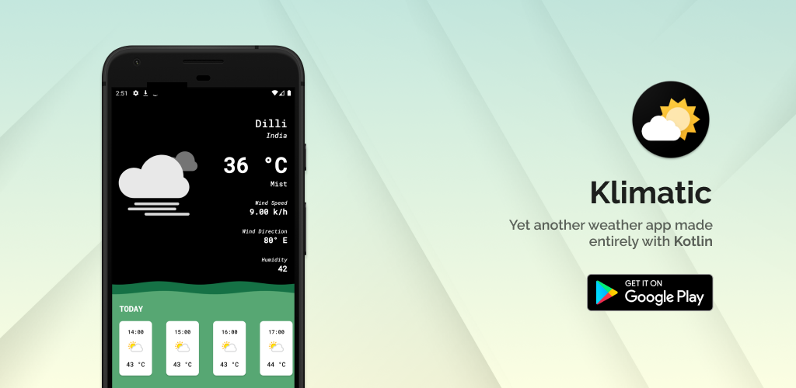

# Klimatic

**Klimatic** is an android app built using **Kotlin**. It try to showcase all the latest technologies used in android.

## Built using
- [Android Architecture Components](https://developer.android.com/topic/libraries/architecture) - Collection of libraries that help you design robust, testable, and maintainable apps.
  - [LiveData](https://developer.android.com/topic/libraries/architecture/livedata) - Data objects that notify views when the underlying database changes.
  - [ViewModel](https://developer.android.com/topic/libraries/architecture/viewmodel) - Stores UI-related data that isn't destroyed on UI changes.
- [Kotlin](https://kotlinlang.org/) - First class and official programming language for Android development.
- [Dependency Injection](https://developer.android.com/training/dependency-injection) 
  - [Koin](https://insert-koin.io/) - A smart dependency injection library.
- [WaveView](https://github.com/developer-shivam/WaveView) - A custom view for wave animation

## Architecture
App uses [MVVM (Model View View-Model)](https://developer.android.com/jetpack/docs/guide#recommended-app-arch) architecture.

## Contributors
[Shivam Satija](https://github.com/developer-shivam) and [Anshul Garg](https://github.com/garganshu)
